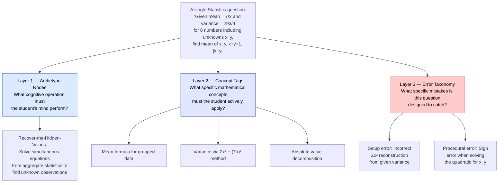
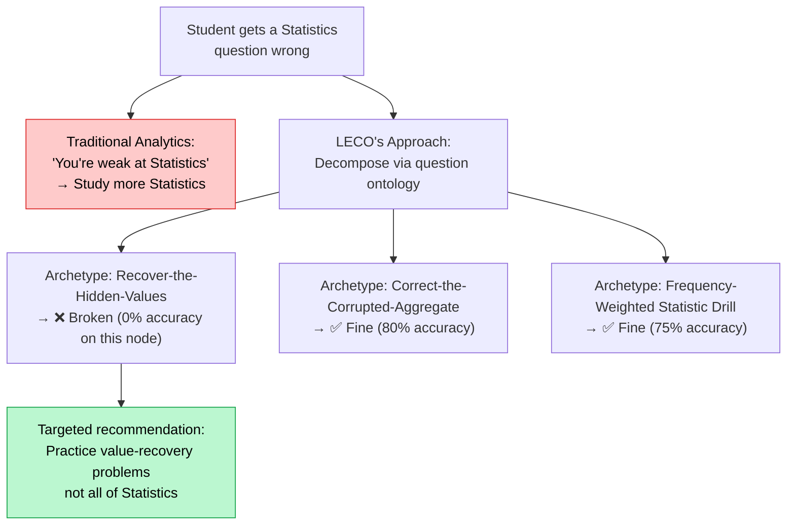
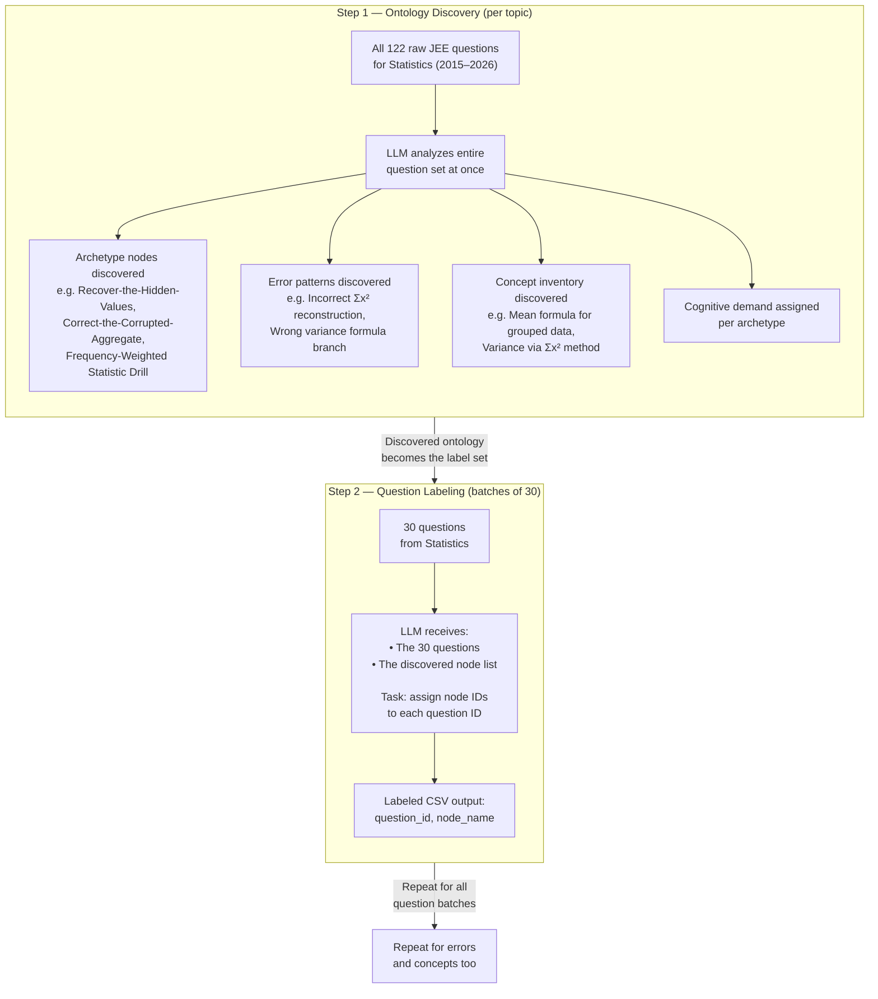
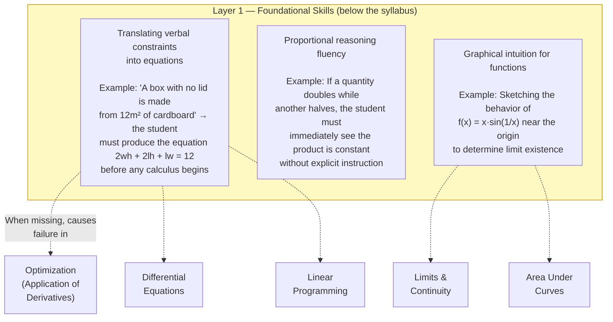
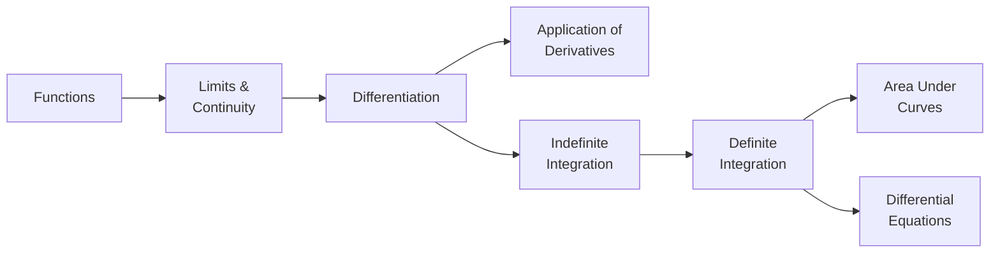
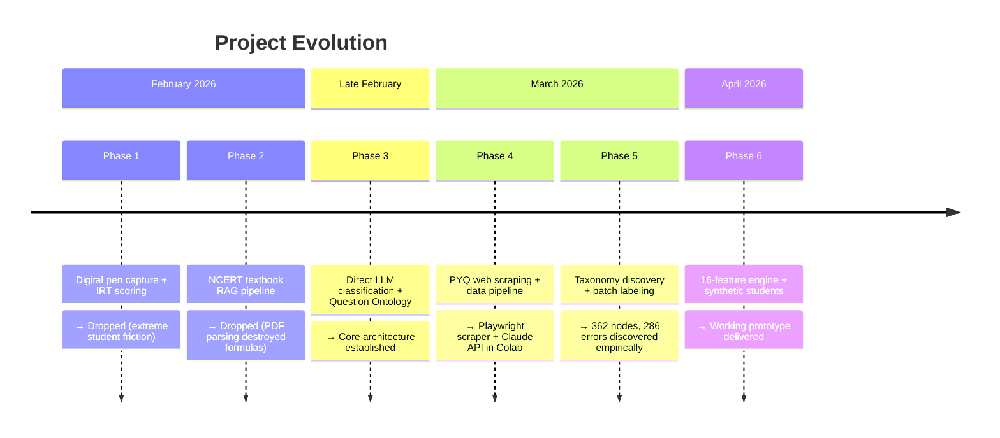

# LECO — Product Case Study

## Building a Diagnostic Engine That Tells Students Why They Fail, Not Just What They Scored

---

## The Problem Nobody Solves

Every assessment platform in the world does the same thing after a student finishes a test: it shows them a score, a list of topics they got wrong, and maybe a bar chart. "You scored 53%. You're weak in Statistics and Probability."

That is useless.

A student staring at 15 weak topics doesn't know where to start. They re-read textbooks they already understand. They practice random questions. They stay stuck — because the real problem is three layers deeper than "Statistics." Maybe their statistics failures are actually caused by a gap in algebraic manipulation that nobody diagnosed. Maybe they understand the concepts perfectly but panic during problem setup and make the same structural mistake across five unrelated topics. Maybe they're overconfident in Matrices — scoring 38% while rating themselves 2.8 out of 3 on confidence — and nobody is telling them their intuition is actively destroying their score.

No evaluation system currently tells a student: "Your problem isn't Statistics. Your problem is that every time a question requires recovering hidden values from given aggregates, you set up the equations wrong — and that same setup failure is showing up in Statistics, Sequences, and Probability simultaneously. Fix the setup skill, and three topics improve at once."

That's what a great tutor does intuitively after watching a student work for a month. LECO is an attempt to automate that intuition.

---

## Where This Idea Came From

This project didn't start from market research. It started from a personal frustration.

As a student — not a top-performer, someone who struggled — I experienced the same evaluation loop repeatedly: take a test, receive a score, see a list of weak areas, feel overwhelmed, not know what to do next. This wasn't specific to one exam or one subject. It was the same experience in school exams, competitive exam preparation, and university assessments. The evaluation always told me *what* I scored. It never told me *why* I was failing in a way that would change how I studied. I was willing to put in the hard work, but I couldn't understand my subjects deeply enough on my own — and I couldn't find a single teacher who could diagnose my weaknesses holistically, across the full exam.

I had a notepad of project ideas I wanted to explore. One line said: "Create an evaluation system that is user-centric and has user empathy." That line turned into a six-month project.

---

## User Research — What I Did and What I Missed

### What I Did

I visited three major coaching institutions in India — Aakash, Allen, and Unacademy — and spoke with the head of faculty for Physics, Chemistry, and Mathematics at each. These are institutions that prepare students for JEE Main (India's largest competitive exam, taken by 1.2 million students annually), and they represent the current state of the art in structured exam preparation.

The interviews surfaced how experienced educators intuitively categorize questions and student failures:

| Subject | Faculty Categorization | Where Students Fail |
|---------|----------------------|---------------------|
| Mathematics | Formula-based, fundamental theory application, critical thinking, calculation-heavy | Mixing up which formula applies to which context |
| Chemistry | Physical (formula + critical analysis), Organic (reagent patterns, bond breaking), Inorganic (pure recall from textbook) | Unit conversions, calculation errors, incomplete memorization |
| Physics | Formula application, unit analysis, diagram-based reasoning | Unit conversions, formula misapplication |

One insight from these discussions reshaped the system's design philosophy. Consider the student who spends 4 minutes on a question, feels confident about it, and still gets it wrong. That pattern — high time investment, high confidence, wrong answer — is the most dangerous quadrant in exam performance. It means the student's mental model is broken in a way they can't detect on their own. Traditional analytics don't surface this. They show you "time taken per question" and "accuracy per topic" as separate metrics. The diagnostic value comes from crossing them: time × confidence × correctness × error type, per node. That cross-analysis became the core of how LECO classifies failure modes.

### What I Missed

I did not interview any students. Not one.

The faculty I spoke with were skeptical about whether deeper-than-topic-level diagnostics were even possible for an MCQ-based exam. They felt that externalizing student cognition from a multiple-choice response was inherently limited.

I did not conduct market analysis. I did not study what existing platforms already offer in their analytics. I did not validate whether coaching institutes would pay for this capability.

I built for six months before testing demand. I've since learned that this is the opposite of how products should be built — and that lesson is part of what this project taught me.

---

## The Core Insight — Questions Have Hidden Structure

Most assessment platforms treat questions as monolithic objects: a question belongs to a topic, and a student either gets it right or wrong. The analytical resolution stops there.

But questions have an endogenous structure — what this project calls a **question ontology**. Every exam question, when examined closely, is actually a composite of three separable analytical layers:

### The Three Layers of Question Ontology

**Archetype nodes** describe *what the student's mind must actually do* to solve the question — not what topic it belongs to, but what cognitive operation it demands. A Statistics question might require "Recover-the-Hidden-Values" (solve simultaneous equations from aggregate statistics to find unknown observations) or "Correct-the-Corrupted-Aggregate" (reverse-engineer a sum and sum-of-squares after an incorrect data point is discovered, then recompute). Two questions from the same topic can require completely different cognitive operations. Two questions from different topics can require the same one.

**Concept tags** are the specific mathematical ideas a student must actively apply — not merely recognize — to reach the answer. "Mean formula for grouped data" and "variance via the Σx² method" are distinct concepts within the same question. If a student gets this question wrong, their weakness might be in one concept but not the other.

**Error taxonomy** maps the specific mistakes a student is likely to make, categorized by root cause. A "setup error" means the student knows the theory but fails to model the problem correctly (they need setup practice, not re-reading). A "procedural error" means the setup was right but a calculation went wrong (they need speed drills, not concept revision). A "conceptual error" means the underlying theory is missing (they need to go back to the textbook). Each question has 1–3 anticipated errors — the traps an examiner designed into it.

### Why This Decomposition Matters

When a student gets a question wrong, traditional analytics register one data point: "Statistics, incorrect." LECO registers three:

1. Which cognitive operation (archetype node) broke
2. Which specific concept within that operation was missing
3. What type of mistake they made (concept gap, setup gap, or execution slip)

Aggregated across 15 tests and 300+ questions, these three layers produce a diagnostic profile that no topic-level accuracy chart can approach.

The student doesn't need "more Statistics." They need to practice one specific cognitive pattern within Statistics — and the system can tell them exactly which one, why it's broken, and what single question to solve next.

---

## What Was Built

### The Labeled Corpus

The foundation of the system is a labeled dataset. For a prototype domain (JEE Main Mathematics, 2015–2026), a corpus of 4,481 exam questions was enriched with the three layers of question ontology — all generated through an LLM-driven pipeline, not manual annotation:

| Layer | What It Captures | Scale |
|-------|-----------------|-------|
| Archetype Nodes | The cognitive operation each question demands | 362 unique nodes across 27 topics |
| Error Taxonomy | Anticipated student mistakes: conceptual, setup, or procedural | 286 unique error patterns |
| Concept Tags | Specific mathematical concepts actively tested | 998 unique concepts |
| Cognitive Demand | How complex the reasoning is, on a 5-level spectrum | From "Direct Application" to "Reverse Engineer" |

### The Taxonomy Discovery Pipeline

The most technically interesting part of the project is how this question ontology was created.

Rather than manually defining categories, the pipeline discovers them empirically from the exam data itself. For each of the 27 topics in the syllabus, the pipeline works in two steps:

**Step 1 — Ontology Discovery:** For a given topic (say, Statistics with 122 questions spanning 2015–2026), all raw questions are sent to the LLM with a structured prompt. The prompt asks the LLM to identify recurring archetype nodes (cognitive operations), a concept inventory, error patterns, and cognitive demand classifications. The prompt deliberately avoids hard numerical constraints ("find 3–6 archetypes") and instead uses logical instructions ("do not split the same pattern into multiple archetypes") — letting the empirical exam data dictate how many categories naturally exist. For Statistics, this produced 8 archetype nodes, 14 error patterns, and 22 concepts.

**Step 2 — Question Labeling:** The discovered ontology then becomes the fixed label set for a second pass. Questions are chunked into batches of 30 and sent to the LLM alongside the full list of discovered categories. The LLM assigns archetype node IDs, concept tags, and error names to each question. The same process repeats for all 27 topics across the syllabus.

This two-step approach (discover the ontology first, then label against it) has a significant advantage over manual taxonomy design: the categories that emerge are grounded in how questions actually cluster in real exams, not in how a curriculum designer thinks they should cluster. The LLM discovers nodes like "Recover-the-Hidden-Values" as a distinct cognitive operation because it appears repeatedly across 12 years of exam data — not because someone decided in advance that this should be a category.

### The Prerequisite Knowledge Graph

Two layers of prerequisite structure tell the engine *why* a student is failing, not just *where*:

**Layer 1 — Foundational Skills (42 skills).** These are the underlying mathematical abilities that sit *below* the formal syllabus. They are not topics taught in class 11th or 12th — they are the cognitive building blocks needed *before* a student can learn those topics effectively. Skills like translating a word problem into algebraic equations, or reasoning about proportional relationships, or reading a graph and extracting function behavior from it. These skills are assumed, never explicitly taught, and when they're missing, they cause correlated failures across topics that look completely unrelated.

The diagnostic power: a student who's weak at "translating verbal constraints into equations" will fail in Optimization, Differential Equations, and Linear Programming simultaneously. Traditional analytics would show three separate topic-level weaknesses. Layer 1 detects the shared root cause — one foundational skill, once fixed, repairs multiple downstream topics.

**Layer 2 — Topic Prerequisites (75 edges).** These are the standard curricular dependencies — "learn Differentiation before Application of Derivatives," "learn Functions before Limits." Their value in the engine is quantitative, not advisory: the system doesn't just tell the student "you need Differentiation" — it shows that their accuracy on Differentiation is 43%, and until they reach 60%, further Application of Derivatives practice will keep failing because the foundation isn't there.

### The 16-Feature Diagnostic Engine

The engine is deterministic Python — no LLM at runtime. It takes a student's test history (which questions they attempted, whether they were correct, how long they spent, and a 1–3 confidence self-rating) and computes 16 diagnostic features across six pipeline stages:

```mermaid
flowchart LR
    subgraph LOCATE["Locate Weakness"]
        F1["Weak\nnodes"]
        F2["Concept\nleaks"]
        F3["Error\nhabits"]
    end

    subgraph CLASSIFY["Classify Failure"]
        F4["Failure\nmodes"]
        F5["Over-\nconfidence"]
        F7["Demand\nprofile"]
    end

    subgraph ROOT["Root Cause"]
        F9["Prereq\ntrace"]
        F10["Foundation\nhypothesis"]
        F11["Momentum"]
    end

    subgraph ACT["Action Plan"]
        F17["Study\nplan"]
        F18["Single\nnext action"]
    end

    LOCATE --> CLASSIFY --> ROOT --> ACT

    style LOCATE fill:#dbeafe,stroke:#2563eb,color:#000000
    style CLASSIFY fill:#fed7aa,stroke:#ea580c,color:#000000
    style ROOT fill:#fecaca,stroke:#dc2626,color:#000000
    style ACT fill:#bbf7d0,stroke:#16a34a,color:#000000
```

The key features and the questions they answer:

| Feature | Question It Answers |
|---------|---------------------|
| Node-Level Weakness Map | Which specific archetype nodes are broken — not "Statistics" but *which cognitive pattern* within Statistics? |
| Concept-Level Precision Drill | Within a broken node, which specific concept is the actual leak? |
| Recurring Error Patterns | Does the student have a behavioral bad habit (e.g., missed constraints in setup) bleeding marks across unrelated topics? |
| Failure Mode Classification | Is this a concept gap, a setup gap, an execution slip, or rushing? Each implies a completely different fix |
| Overconfidence Detection | Where does the student feel confident but score poorly? These are dangerous blind spots they'll never self-correct |
| Prerequisite Trace | Is Topic X failing because upstream Topic Y is broken? Should the student fix Y first? |
| Foundational Skill Hypothesis | Are failures in unrelated topics caused by a shared below-syllabus cognitive gap? |
| Single Next-Action | The one question to solve right now, at the right difficulty, with an explanation of why |

The architectural decision to make the engine deterministic (no LLM at runtime) was driven by how the system was designed from the start: the entire approach is built around extracting as much structured information as possible from the questions themselves, then storing that as static labeled data. Once the question corpus is labeled, the per-student diagnostic computation runs with zero API calls. For a B2B2C product serving thousands of students through coaching institutes, this makes the marginal cost of each student's diagnosis effectively zero.

The only LLM call in the live product would be optional — generating a human-readable report from the clinical diagnostic output, wrapped in a conversational persona (a motivational coach, a direct friend, a humorous mentor) to make the evaluation feel less like a report card and more like advice from someone who knows you. The hypothesis behind the persona system is that knowledge retention improves when information is delivered with engagement and familiarity — a principle observed repeatedly in classroom settings where the best teachers use humor and personality, not clinical distance.

---

## The Build Journey — Six Phases in Four Months

### Pivots and What Drove Them

| What Was Tried | What Failed | What Replaced It | The Lesson |
|---------------|------------|-----------------|------------|
| Capture handwritten rough work via digital pen | Students wouldn't use it during a timed exam | 1-click confidence rating (1–3 scale) | The best data collection is the one users will actually do |
| Parse NCERT textbooks into a vector database for concept tagging | PDF extractors destroyed math formulas and broke on two-column layouts | Direct LLM classification — the model already knows the curriculum | Don't build retrieval infrastructure for knowledge the model already has |
| Label 90,000 questions from a Kaggle dataset | Too slow and expensive for a prototype; questions lacked worked solutions | Scope down to 4,481 previous-year questions that had full solutions | A smaller, richer dataset beats a larger, thinner one |
| Six-level Bloom's Taxonomy for cognitive classification | Six levels produced the same study recommendation | Five-level cognitive demand spectrum discovered empirically from the data | Taxonomies derived from data beat taxonomies imposed from theory |
| Error taxonomy nested inside archetype nodes | Same error appears across multiple archetypes; couldn't aggregate | Decoupled error taxonomy mapped directly to questions | If an entity recurs across categories, it belongs in its own table |
| Start with Chemistry as the prototype subject | Many Chemistry questions required structural diagrams that the text pipeline couldn't represent | Switch to Mathematics — fully expressible in text and LaTeX | Choose the domain that proves the concept with minimum data friction |

---

## What I Built vs. What the LLM Built

This project used LLMs extensively, and I want to be transparent about the division of work.

| Contribution | Source |
|-------------|--------|
| Problem identification and framing | Mine — from personal experience as a student |
| Faculty interviews at 3 coaching institutes | Mine — conducted in person |
| Decision to decompose questions into ontological layers (nodes, concepts, errors) | Mine — the conceptual framework of question ontology was my design |
| Pivot decisions (when to kill an approach and what to build instead) | Mine — each pivot was a strategic judgment call |
| Architecture of the 16-feature engine (which features exist, what each computes, how they depend on each other) | Collaborative — I defined what each feature should measure, the LLM helped formalize the math and write the code |
| The 6-section prompt for ontology discovery | Collaborative — I defined the sections and the analytical goals, the LLM helped refine wording and output format |
| The 3 labeling prompts (nodes, concepts, errors) | Collaborative — I wrote the assignment rules based on what I needed from the data, the LLM helped structure them |
| All Python code (scraper, text cleaner, engine, synthetic students) | Primarily LLM — I directed what to build and reviewed the output, the LLM wrote the majority of the implementation |
| Prerequisite knowledge graph design (both layers) | Collaborative — I defined the concept of foundational skills vs. topic prerequisites, the LLM helped enumerate and describe them |
| Prompt engineering and iteration across 6 prompt versions | Mine — each prompt went through multiple revisions based on output quality |

I would not have been able to build this system in six months without LLM collaboration. What I consider my core contribution is the problem framing, the strategic decisions, and the analytical architecture — deciding *what* to build, *what to kill*, and *how the pieces fit together*. The implementation velocity was multiplied by working with Claude and Gemini as collaborative tools. I consider the ability to architect complex systems with AI tools to be a core working skill, not a shortcut.

---

## Honest Assessment

### What Works

The analytical framework is sound. The decomposition of questions into archetype nodes, concept tags, and error taxonomy — three separable diagnostic layers — produces genuinely useful signals when aggregated across a student's test history. The overconfidence detection (crossing confidence ratings with accuracy per node) surfaces blind spots that no traditional metric captures. The prerequisite trace (checking upstream topic accuracy before recommending more downstream practice) prevents the most common and most wasteful pattern in self-study: practicing the wrong thing.

The empirical taxonomy discovery pipeline is a real contribution. Most LLM classification systems start with a predefined label set. This one lets the labels emerge from the exam data. 362 archetype nodes were discovered across 27 topics — not designed by a curriculum expert, but found by asking "what cognitive patterns actually recur in 12 years of exam questions?"

The deterministic engine architecture means the per-student cost at runtime is zero. Once the question corpus is labeled, diagnostics run on pure Python with no API calls.

### What Doesn't Work Yet

The output is not usable by a student in its current form. The archetype node names ("Recover-the-Hidden-Values," "Correct-the-Corrupted-Aggregate") are clinically precise but intimidating. The 16 features produce a wall of diagnostic data that needs a translation layer to become something a student would actually read, understand, and act on. The system computes the right things — but the last mile from engine output to student experience has not been built. It's a diagnostic MRI machine without the doctor who explains the scan.

The LLM-generated taxonomy has not been validated. Whether the 362 discovered nodes are the right granularity, whether they're internally coherent, and whether the same pipeline would produce the same taxonomy on a second run — none of this has been tested.

There is no student validation. The system was tested with synthetic data only. The faculty I interviewed were skeptical about the approach, and that skepticism has not been addressed with evidence.

The market positioning is undefined. Whether coaching institutes would pay for this capability, how it would integrate with existing test platforms, and whether students would engage with the output — these are open questions that six months of engineering did not answer.

### What I Learned

Building for six months without talking to users taught me the most important product lesson the hard way: the smallest vertical slice — one feature, one user, one test — should be validated before building the full system. If I were starting today, I would build the prerequisite trace alone, run it on one real student's test data, and ask them: "Does this match your experience? Is this useful?" Everything else would follow or not based on that signal.

I also learned that I gravitate toward strategic problem decomposition and system architecture — taking an ambiguous problem, breaking it into tractable sub-problems, and designing how the pieces fit together. That was the part of this project I found most energizing, and where I moved fastest — including through failures. The strategic pivots (killing the RAG pipeline, scoping from 90K to 4.5K questions, switching subjects when Chemistry data broke) were decisions I made quickly and correctly. The failure was not in strategy but in sequencing: I should have validated demand before investing in depth.

---

## What This Project Is

LECO is a prototype that demonstrates a specific product thesis: that assessment analytics can go far deeper than topic-level accuracy to identify the exact cognitive pattern, the root cause, and the single most impactful next action for each individual student.

It was built solo over four months. It went through six major pivots. It produced a working diagnostic engine, a labeled dataset of 4,481 questions with ~28,000 analytical labels across three ontological layers, a two-layer prerequisite knowledge graph, and a pipeline architecture that scales to any standardized assessment — not just the exam it was prototyped on.

It did not produce a finished product. It did not validate market demand. The distance between the engine's clinical output and something a real student would find useful remains the largest unsolved problem.

The strongest thing this project demonstrates is strategic thinking under ambiguity — taking a vague problem ("evaluations should be more personal"), decomposing it into a tractable analytical architecture, building and testing approaches, killing the ones that don't work, and shipping something that proves the core idea even if the edges are rough.

The underlying conviction — that every student deserves an evaluation built on user empathy, not just numerical metrics — is something I brought to this project from my own experience, and it's what I want to bring to whatever I work on next.
