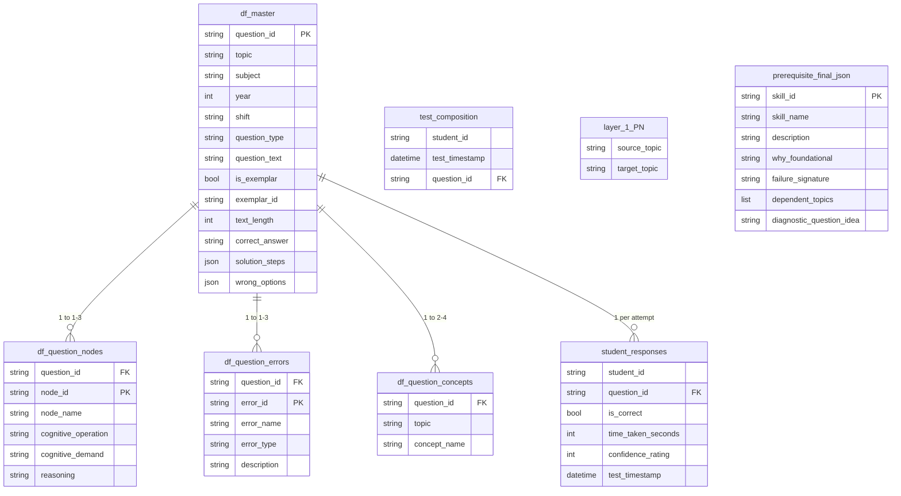
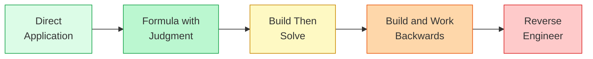
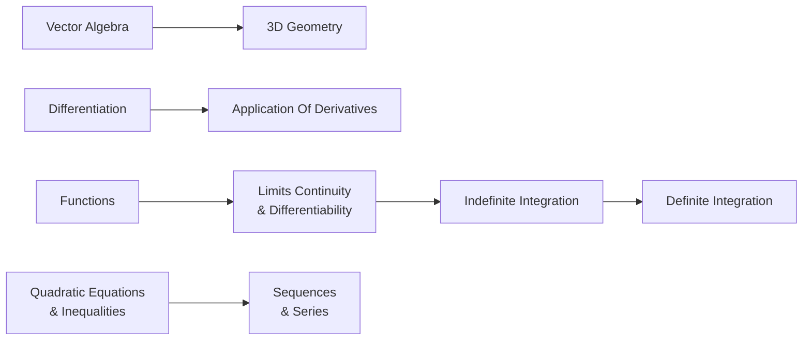

# Data Schema

Complete schema for all tables in the LECO diagnostic engine. Six static data files ship with the repository. Two tables (student_responses, test_composition) are generated synthetically for testing.

---

## Entity Relationship



---

## Corpus at a Glance

| Metric | Value |
|--------|-------|
| Total questions | 4,481 |
| Years covered | 2015 – 2026 |
| Topics | 27 |
| Question types | MCQ + Numerical |
| Exemplar questions | 993 |
| Unique reasoning nodes | 362 |
| Unique error patterns | 286 |
| Unique concepts | 998 |
| Prerequisite edges | 75 |
| Foundational skills | 42 |
| Avg nodes per question | ~1.15 |
| Avg errors per question | ~1.23 |
| Avg concepts per question | ~2.63 |

---

## 1. df_master.csv — Core Question Bank

The primary question table. 4,481 JEE Main Mathematics PYQs with full question text, worked solutions, and wrong options.

| Column | Type | Description |
|--------|------|-------------|
| question_id | string | Primary key. Format: Q_M_{topic_num}_{seq} |
| topic | string | JEE syllabus topic. 27 distinct values |
| subject | string | Always Mathematics in this prototype |
| year | integer | Exam year (2015 – 2026) |
| shift | string | Exam shift, e.g. 28th January Morning |
| question_type | string | MCQ or Numerical |
| question_text | string | Full question text with LaTeX-standardized math |
| is_exemplar | boolean | True if this question is the archetype-defining exemplar for its node |
| exemplar_id | string | Links to the exemplar this question maps to. Blank if self-exemplar |
| text_length | integer | Character count of question_text. Proxy for reading load |
| correct_answer | string | Correct option text (MCQ) or numeric value (Numerical) |
| solution_steps | JSON | Ordered steps, each with fields: step, action, concept_used |
| wrong_options | JSON | List of 3 incorrect options (MCQ). Empty for Numerical |

All 27 topics:

```
3D Geometry · Application Of Derivatives · Area Under The Curves · Binomial Theorem
Circle · Complex Numbers · Definite Integration · Differential Equations · Differentiation
Ellipse · Functions · Hyperbola · Indefinite Integration · Inverse Trigonometric Functions
Limits Continuity And Differentiability · Logarithm · Mathematical Reasoning
Matrices And Determinants · Parabola · Permutations And Combinations · Probability
Quadratic Equation And Inequalities · Sequences And Series · Sets And Relations
Statistics · Straight Lines And Pair Of Straight Lines · Trigonometric Ratio And Identites
Vector Algebra
```

Sample row:

```json
{
  "question_id": "Q_M_01_001",
  "topic": "3D Geometry",
  "year": 2026,
  "question_type": "MCQ",
  "correct_answer": "7",
  "wrong_options": ["5", "8", "9"],
  "solution_steps": [
    {"step": 1, "action": "Identify the given point P", "concept_used": "Point of intersection"}
  ]
}
```

---

## 2. df_question_nodes.csv — Reasoning Archetype Mappings

Maps each question to its constituent reasoning nodes — the atomic micro-skills required to solve it. One question maps to 1–3 nodes. This is the Question DNA layer.

| Column | Type | Description |
|--------|------|-------------|
| question_id | string | Foreign key → df_master |
| node_id | string | Unique node identifier. Format: N_M_{topic_num}_{seq} |
| node_name | string | Human-readable node label, e.g. Log-equation-to-polynomial reduction |
| cognitive_operation | string | 1–3 sentence description of the cognitive work required |
| cognitive_demand | string | Complexity tier from the 5-level spectrum below |
| reasoning | string | Explanation of why this demand level was assigned |

Cognitive demand spectrum (ascending):



| Level | What the student does | Example |
|-------|-----------------------|---------|
| Direct Application | Plug values into a known formula | Evaluate a definite integral using a standard result |
| Formula with Judgment | Choose the right formula, then apply | Decide between integration by parts vs substitution |
| Build Then Solve | Construct the mathematical setup from scratch | Translate a word problem into a system of equations |
| Build and Work Backwards | Forward setup then backward verification | Solve, then eliminate extraneous solutions |
| Reverse Engineer | Deduce conditions from a given result | Given the answer is 7, find the parameter value |

Sample row:

```json
{
  "question_id": "Q_M_15_001",
  "node_id": "N_M_16_003",
  "node_name": "Log-equation-to-polynomial reduction",
  "cognitive_demand": "Formula with Judgment",
  "cognitive_operation": "Convert a logarithmic equation into a polynomial by substitution, then solve."
}
```

---

## 3. df_question_errors.csv — Error Taxonomy

Maps questions to the errors a student is likely to make. 1–3 anticipated errors per question. These are the traps an examiner designed into the question — not post-hoc labels but forward-modeled failure paths.

| Column | Type | Description |
|--------|------|-------------|
| question_id | string | Foreign key → df_master |
| error_id | string | Unique error identifier. Format: ERR_M_{topic_num}_{seq} |
| error_name | string | Concise error label, e.g. Domain-blind solving |
| error_type | string | One of three categories: Conceptual, Setup, or Procedural |
| description | string | Full explanation of how and why the error occurs |

Error type taxonomy:

| Type | Root Cause | What the student needs |
|------|-----------|----------------------|
| Conceptual error | Missing or incorrect underlying theory | Re-study the concept |
| Setup error | Knows the theory but fails to model the problem | Practice problem translation |
| Procedural error | Sets up correctly but makes a mechanical mistake | Computation practice under time pressure |

Sample row:

```json
{
  "question_id": "Q_M_15_002",
  "error_id": "ERR_M_16_002",
  "error_name": "Domain-blind solving",
  "error_type": "Setup error",
  "description": "Solves the logarithmic equation algebraically but fails to verify constraints: base > 0, base ≠ 1, argument > 0. Reports extraneous solutions."
}
```

---

## 4. df_question_concepts.csv — Concept Tags

Maps questions to the mathematical concepts they test. 2–4 concepts per question. Used by F2 (Concept-Level Precision Drill) to isolate the exact conceptual leak within a weak node.

| Column | Type | Description |
|--------|------|-------------|
| question_id | string | Foreign key → df_master |
| topic | string | The topic this concept belongs to |
| concept_name | string | Specific mathematical concept tested |

Sample row:

```json
{
  "question_id": "Q_M_01_001",
  "topic": "3D Geometry",
  "concept_name": "Distance from a point to a line along a prescribed direction"
}
```

---

## 5. layer_1_PN.txt — Topic Prerequisite Graph

Directed edges representing topic-level prerequisites. An edge A → B means mastering A is required before B can be learned effectively. Used by F9 to trace root causes through the prerequisite chain.

| Column | Type | Description |
|--------|------|-------------|
| source_topic | string | The prerequisite (upstream) topic |
| target_topic | string | The dependent (downstream) topic |

Sample prerequisite edges:



Loaded in the engine as:

```python
prerequisite_graph = {target_topic: [source_topic, ...]}
```

---

## 6. prerequisite_final.json — Foundational Skills

42 below-syllabus cognitive skills that are never explicitly taught but cause correlated failures across unrelated topics. Used by F10 (Foundational Skill Hypothesis) to find root causes that topic-level analysis misses entirely.

| Field | Type | Description |
|-------|------|-------------|
| skill_id | string | Primary key. F001 – F042 |
| skill_name | string | Concise label, e.g. Translating verbal constraints into equations |
| description | string | What the skill involves, in 2–3 sentences |
| why_foundational | string | Why this does not appear in topic-level analysis |
| failure_signature | string | Observable pattern when a student lacks this skill |
| dependent_topics | list | Topics that rely on this skill, each with topic and how_it_manifests |
| diagnostic_question_idea | string | A single question that tests this skill in isolation |

Sample entry:

```json
{
  "skill_id": "F001",
  "skill_name": "Translating verbal or geometric constraints into equations",
  "failure_signature": "Student stalls at the first line of algebra. Sets up no equations from the problem text.",
  "dependent_topics": [
    {"topic": "Application Of Derivatives", "how_it_manifests": "Optimization problems — cannot write the objective function"},
    {"topic": "Differential Equations", "how_it_manifests": "Cannot convert the word model into a differential equation"}
  ],
  "diagnostic_question_idea": "A rectangular box with no lid is made from 12 m² of cardboard. Find the dimensions that maximize volume."
}
```

---

## 7. student_responses — Per-Test Attempt Data (Synthetic)

One row per question attempt. Generated for 5 synthetic students × 15 tests × ~25 questions each.

| Column | Type | Description |
|--------|------|-------------|
| student_id | string | Student identifier, e.g. PRIYA |
| question_id | string | Foreign key → df_master |
| is_correct | boolean | Whether the student answered correctly |
| time_taken_seconds | integer | Time spent on this question |
| confidence_rating | integer | Self-reported confidence: 1 = low, 2 = medium, 3 = high |
| test_timestamp | datetime | When the test was taken. Used for momentum tracking in F11 |

---

## 8. test_composition — Test Structure (Synthetic)

All questions assigned to each test, including unattempted ones. Required by F15 (Time ROI) to calculate how time was allocated across the full paper.

| Column | Type | Description |
|--------|------|-------------|
| student_id | string | Student identifier |
| test_timestamp | datetime | Matches timestamps in student_responses |
| question_id | string | Foreign key → df_master |

---

## Synthetic Student Profiles

| Student | Accuracy | Learning Personality |
|---------|----------|----------------------|
| PRIYA | 53% | Balanced weaknesses, setup gaps dominant |
| ARJUN | 65% | Strong overall but overconfident in specific nodes |
| MEERA | 64% | Good at pattern recognition, weak at abstract algebra |
| RAHUL | 35% | Broadly weak, many concept gaps |
| KAVYA | 45% | Improving trajectory, cold streak in specific topics |
