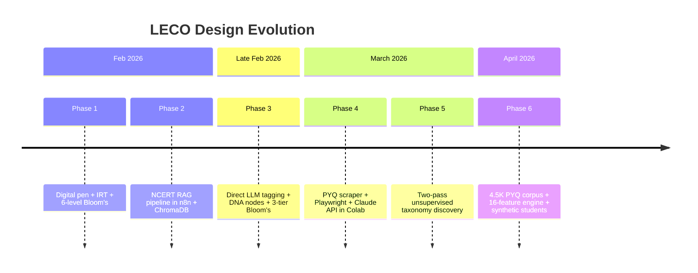
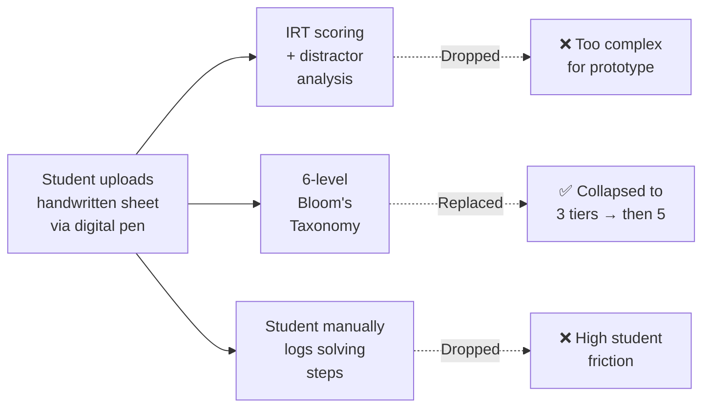
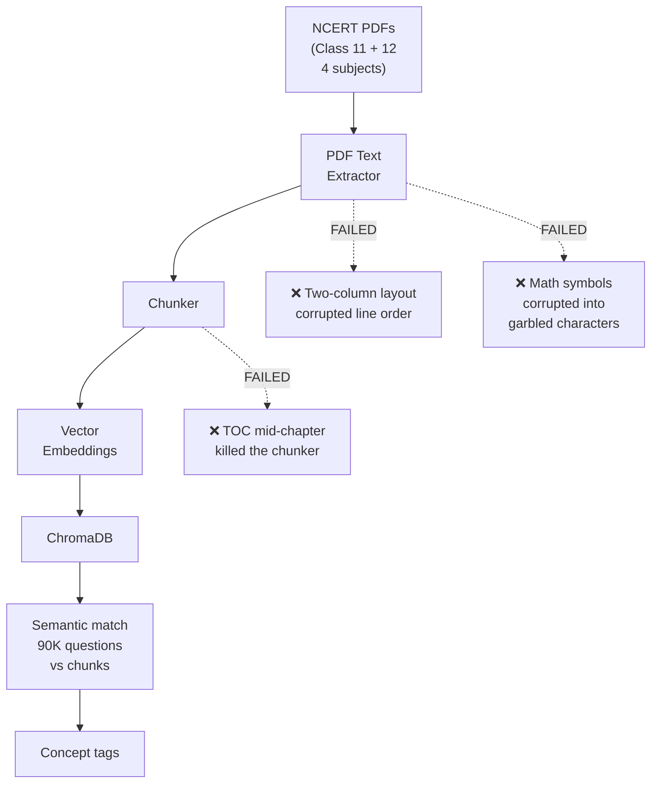
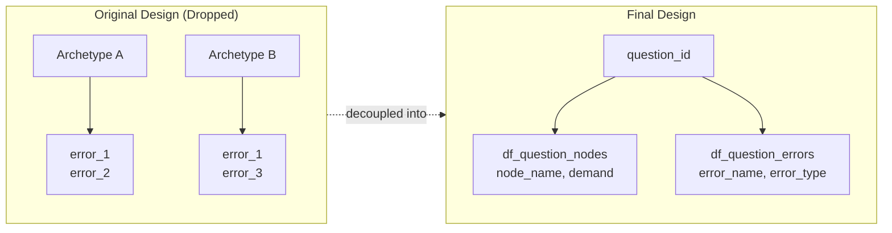
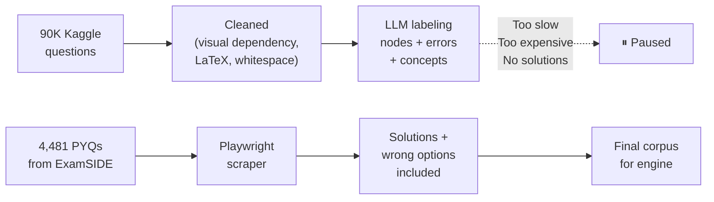

# Exploration Log

Six design phases over four months (February – May 2026). Several approaches were built, tested, and deliberately dropped. The failures shaped the final design as much as the successes.

---

## Timeline of Pivots

---

## Decision Summary

| Approach | Phase | Status | What Replaced It |
|----------|-------|--------|-----------------|
| Digital pen rough work capture | 1 | Dropped | Confidence tagging (1–3 click) |
| Six-level Bloom's Taxonomy | 1 | Replaced | 5-level cognitive demand spectrum |
| NCERT textbook RAG pipeline | 2 | Dropped | Direct LLM classification |
| 90,000-question Kaggle corpus | 4 | Paused | 4,481 PYQ corpus with solutions |
| Error taxonomy nested in archetypes | 5 | Decoupled | Separate df_question_errors table |
| Conceptual vs Procedural column | 3 | Dropped | Redundant with Bloom's tiers |
| Student step-selection during test | 1–3 | Dropped | time_taken + confidence_rating |

---

## Phase 1 — Digital Pen and IRT (Early Feb 2026)

The initial system required students to upload handwritten calculation sheets through a digital pen during mock tests. The engine would analyze these using Item Response Theory and a six-level Bloom's Taxonomy classification.

Three problems killed it simultaneously. First, the operational friction was immense — JEE students under exam stress would not reliably upload scan sheets or log steps. Second, six Bloom's levels (Remember, Understand, Apply, Analyze, Evaluate, Create) produced indistinguishable study recommendations — Understand and Apply both led to "practice more problems." Third, the IRT scoring required a calibrated item bank that did not exist yet.

What replaced it: a one-click confidence tag (1 = low, 2 = medium, 3 = high) captured at question submission. Combined with time_taken and the selected option, this unlocks the same failure mode classification without any extra student action.

> The best data collection is the one students will actually do. Metadata inference beats explicit self-reporting for a prototype.

---

## Phase 2 — NCERT Textbook RAG Pipeline (Mid Feb 2026)

A full RAG pipeline was built in n8n to tag 90,000 questions with syllabus concepts. The plan: parse NCERT Class 11 and 12 PDFs across four subjects, split them into chunks, embed them in ChromaDB, and run semantic matching between questions and textbook passages.

Three compounding technical failures ended it.

NCERT PDFs use a vertical two-column layout. Text extractors merged the columns horizontally, producing broken line-wraps and semantically incoherent paragraphs. Mathematical formulas, Greek symbols, superscripts, subscripts, and chemical equations were routinely corrupted into unreadable characters — a fundamental limitation of PDF text extraction for STEM content. Formatting rules designed to strip Tables of Contents, summaries, and end-of-chapter exercises failed because the TOC appeared mid-chapter in some PDFs, causing the script to terminate prematurely and skip entire sections.

The deeper realization: high-parameter LLMs (Claude, GPT-4) are already trained on standard academic curricula including NCERT content. The system did not need to retrieve NCERT context to perform basic categorization — it already knew the material. The entire RAG pipeline was an unnecessarily complex way to obtain concept tags that the LLM could assign directly.

> Don't build retrieval infrastructure for knowledge the model already has. RAG is valuable when the model genuinely lacks the information. For well-known curricula, it is overhead.

---

## Phase 3 — Taxonomy Pivots (Late Feb 2026)

Two structural changes happened here that shaped everything downstream.

### Bloom's Taxonomy → Cognitive Demand Spectrum

| Original (Dropped) | Problem | Replacement |
|--------------------|---------|-------------|
| Remember | Yielded same advice as Understand | Direct Application |
| Understand | Indistinguishable from Apply | Formula with Judgment |
| Apply | Same recommendation as Understand | Build Then Solve |
| Analyze | Hard to distinguish from Evaluate in JEE context | Build and Work Backwards |
| Evaluate | Indistinguishable from Analyze | Reverse Engineer |
| Create | No JEE question required this level | — |

The five-level cognitive demand spectrum was not designed top-down. It emerged empirically from the Pass 1 LLM analysis — the LLM was asked what types of cognitive work these questions require, and the five natural clusters appeared in the output. Taxonomies derived from data beat taxonomies imposed from theory.

### Error Taxonomy Decoupled from Archetypes

The original design nested error types inside individual reasoning archetypes. Each archetype had its own error set. During validation this broke: the same error type (e.g. domain-blind solving) appeared across multiple distinct archetypes. When the error was locked inside one archetype's definition, it could not be counted consistently across a student's history.

Errors are now mapped directly to questions in a separate table. F3 (Recurring Error Patterns) can aggregate a single error type across all topics and archetypes to detect systemic bad habits.

---

## Phase 4 — 90,000-Question Corpus (March–April 2026)

The 90K-question Kaggle dataset was successfully cleaned — the preprocessing notebook handled visual dependency detection, LaTeX syntax cleanup, and whitespace normalization. But labeling 90K questions across multiple complex columns (nodes, errors, concepts — each requiring per-question LLM calls) was too slow and expensive for a prototype sprint.

More critically: the 90K dataset lacked worked solutions and wrong-option explanations. Error taxonomy labeling requires knowing which specific wrong option a student picked and why that option is wrong. Without solutions, the error labels would have been shallow.

The PYQ corpus from ExamSIDE had complete solution step breakdowns and wrong options for every question. This made it possible to generate high-fidelity node and error labels. Smaller and richer beat larger and thinner.

The 90K cleaning notebook remains in the repository. The cleaning logic is reusable when the corpus is scaled in a future iteration.

> A smaller, richer dataset beats a larger, thinner one for building a prototype.

---

## Phase 5 — Two Dropped Columns (Late March 2026)

Two fields were specified in early schema designs and dropped before the final labeling run.

### Conceptual vs Procedural Column

A binary column classifying each question as Conceptual or Procedural was specified in the early schema. It was dropped when the team realized it directly overlapped with the collapsed Bloom's tiers — Conceptual mapped exactly to Remember/Understand, and Procedural mapped exactly to Apply. It added no diagnostic information not already captured by the cognitive demand field.

### Student Step-Selection During Test

An interface element was designed where the student, after answering a question, would select which solution steps they performed from a displayed list. This was meant to capture where exactly the student's reasoning broke down.

It was dropped for the same reason as the digital pen: students would not reliably click through a step list during a timed exam. The engine infers which step likely failed by cross-referencing the selected wrong option against the error taxonomy — which step-failure would cause a student to choose that specific wrong answer?

time_taken + selected option + confidence_rating carry the same diagnostic signal with zero added friction.
