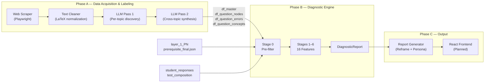
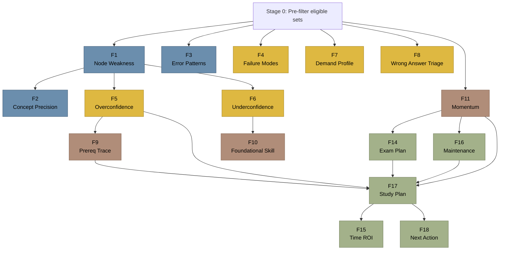

# LECO — Learning Engine for Cognitive Optimization

A deterministic diagnostic engine that analyzes JEE exam performance at the micro-skill level, traces failure to its root cause through a prerequisite knowledge graph, and produces a single, targeted next-action recommendation instead of an overwhelming dashboard of weaknesses.

Built on a labeled corpus of **4,481 JEE Mathematics PYQs** (2015–2026) enriched with reasoning archetypes, error taxonomies, and concept tags — all extracted through a two-pass unsupervised LLM discovery pipeline.

---

## The Problem

Every test-prep platform tells students the same thing: *"You're weak at Calculus."* That's useless. A student staring at 15 weak topics doesn't know where to start. They re-read textbooks they already understand, practice random questions, and stay stuck — because the real problem is three layers deeper than "Calculus."

LECO asks a different question: **Why is this student failing, and what single action will move their score the most right now?**

## What Makes This Different

**Micro-skill resolution, not topic-level.** Questions aren't tagged as "Calculus" — they're tagged with atomic reasoning nodes like *Piecewise Dissection via Absolute Value* or *Tangent-at-a-Point with External Constraint*. A student failing "Calculus" might actually be fine at integration but broken at a single setup pattern.

**Root-cause tracing, not symptom listing.** A directed prerequisite graph (75 topic-level edges + 42 below-syllabus foundational skills) lets the engine trace a failure in Definite Integration back to a gap in Limits — and tell the student to fix Limits first, because more Integration practice will keep failing until the foundation is repaired.

**Behavioral diagnosis from metadata.** Without requiring students to log their work, the engine infers failure modes from time-taken, confidence ratings, and error patterns: distinguishing concept gaps from setup gaps from execution slips from rushed guesses.

**One question with a reason.** The output isn't a dashboard. It's a single, specific question selected from the corpus at the student's ideal difficulty level, with an LLM-generated explanation of exactly why that question was chosen based on their diagnostic profile.

---

## Architecture Overview



See [`docs/ARCHITECTURE.md`](docs/ARCHITECTURE.md) for the full pipeline specification, feature dependency graph, and the math behind the diagnostic computations.

---

## The 16 Diagnostic Features

The engine computes 16 features in a strict dependency order across 6 stages:

| # | Feature | What It Answers |
|---|---------|-----------------|
| F1 | Node-Level Weakness Map | Which exact micro-skills are broken (not "Calculus" — *which* pattern within Calculus)? |
| F2 | Concept-Level Precision Drill | Within a weak node, which specific concept is the actual leak? |
| F3 | Recurring Error Patterns | Does the student have a behavioral bad habit bleeding marks across unrelated topics? |
| F4 | Failure Mode Classification | Are failures from concept gaps, setup gaps, execution slips, or rushing? |
| F5 | Overconfidence Detection | Where does the student feel confident but score poorly? (Dangerous blind spots) |
| F6 | Underconfidence Detection | Where does the student score well but doubt themselves? (Wasted anxiety) |
| F7 | Cognitive Demand Profile | At what complexity tier does the student's accuracy collapse? |
| F8 | Wrong Answer Triage | On today's test: which wrong answers are slips vs. expected misses vs. stretch questions? |
| F9 | Topic Prerequisite Trace | Is the student failing Topic X because upstream Topic Y is broken? |
| F10 | Foundational Skill Hypothesis | Are unrelated topic failures caused by a shared below-syllabus cognitive gap? |
| F11 | Performance Momentum | Is the student improving, declining, or stagnating — and in which topics? |
| F14 | Exam Phase Plan | On exam day: which topics to attack first, save for later, or skip entirely? |
| F15 | Time ROI & Clock Management | How many marks were lost to time misallocation on the last test? |
| F16 | Maintenance Mode | Which mastered topics can be safely deprioritized to reclaim study hours? |
| F17 | Study Focus Plan | Ranked priority list with daily minute budgets and micro-goals per topic |
| F18 | Single Next-Action | The exact question to solve right now, selected at the ideal difficulty, with an explanation |

### Feature Dependency Graph



>  Blue = Weakness Detection (F1–F3) ·  Orange = Failure Classification (F4–F8) ·  Red = Root Cause (F9–F11) ·  Green = Strategy & Action (F14–F18)

---

## Data Overview

The prototype corpus covers **JEE Main Mathematics** across 12 years (2015–2026), 27 topics, and two question types (MCQ + Numerical). All data was generated through a two-pass unsupervised LLM discovery pipeline — no manual annotation.

| Table | Rows | Purpose |
|-------|------|---------|
| `df_master` | 4,481 | Core question bank with text, solutions, wrong options |
| `df_question_nodes` | 5,150 | 362 unique reasoning nodes mapped to questions |
| `df_question_errors` | 5,522 | 286 unique error patterns across 3 types |
| `df_question_concepts` | 11,784 | 998 unique concepts mapped to questions |
| `layer_1_PN` | 75 edges | Directed topic prerequisite graph |
| `prerequisite_final` | 42 skills | Below-syllabus foundational skill definitions |

See [`DATA_SCHEMA.md`](DATA_SCHEMA.md) for full column descriptions, value domains, and sample rows.

---

## Repository Structure

| Path | Description |
|------|-------------|
| `data/df_master.csv` | 4,481 PYQs (question text, solutions, wrong options) |
| `data/df_question_nodes.csv` | 5,150 question→node mappings with cognitive demand |
| `data/df_question_errors.csv` | 5,522 question→error mappings with error types |
| `data/df_question_concepts.csv` | 11,784 question→concept mappings |
| `data/layer_1_PN.txt` | 75 topic-level prerequisite edges |
| `data/prerequisite_final.json` | 42 foundational skills with diagnostic questions |
| `notebooks/01_data_preparation.ipynb` | PYQ scraping, cleaning, LaTeX standardization |
| `notebooks/02_core_tables_extraction.ipynb` | Two-pass LLM pipeline: nodes, errors, concepts |
| `notebooks/03_diagnostic_engine.ipynb` | Full 16-feature engine + synthetic student demo |
| `notebooks/exploratory/90k_cleaning.ipynb` | 90K Kaggle question cleanup (not used in final) |
| `docs/ARCHITECTURE.md` | Pipeline spec, feature dependency graph, math formulations |
| `docs/exploration_log.md` | Dropped approaches and lessons learned |
| `sample_output/` | Example diagnostic report for one synthetic student |

---

## Notebooks

**`01_data_preparation.ipynb`** — Playwright-based scraper for online PYQ banks. Simulates scroll behavior for lazy-loaded questions, joins fragmented paragraph elements at the source, flags image-dependent questions via `` tag inspection, and standardizes mathematical notation into LaTeX. Also consolidates the Claude API call into the same Colab notebook to avoid browser-session hangs from heavy CSV uploads.

**`02_core_tables_extraction.ipynb`** — The two-pass LLM labeling pipeline. Pass 1 evaluates ~100 questions per topic to discover recurring reasoning archetypes, concept co-occurrences, and error patterns. Pass 2 synthesizes cross-topic outputs to deduplicate nodes, extract universal cognitive operations, and produce the final master vocabulary. Outputs all four core tables.

**`03_diagnostic_engine.ipynb`** — The complete 16-feature diagnostic engine. Loads all data tables, generates synthetic student profiles (5 students × 15 tests × ~300 questions each), runs the full pipeline, and prints diagnostic report summaries. This is the core deliverable.

**`90k_cleaning.ipynb`** *(exploratory)* — Text preprocessing pipeline for a 90K-question Kaggle dataset. Handles visual dependency detection, LaTeX presentation syntax cleanup, and whitespace normalization. This dataset was explored but not used in the final prototype (see [Exploration Log](docs/exploration_log.md)).

---

## Running the Engine

The engine runs in Google Colab with no special infrastructure. Upload the `data/` folder to Google Drive and run the notebooks in order.

```python
from leco_engine import run_diagnostic_engine

report = run_diagnostic_engine(
    student_id='PRIYA',
    student_responses=df_student_responses,
    test_composition=df_test_composition,
    df_master=df_master,
    df_question_nodes=df_question_nodes,
    df_question_errors=df_question_errors,
    df_question_concepts=df_question_concepts,
    prerequisite_graph=prerequisite_graph,
    foundational_skills=foundational_skills,
)

print_report_summary(report)
```

Dependencies: `pandas`, `numpy`, `scipy` (all pre-installed in Colab).

---

## Sample Output

For synthetic student **PRIYA** (53% accuracy across 15 tests, 335 responses):

| Feature | Result |
|---------|--------|
| F1  Weak nodes | 18 flagged. Top: Evaluate-After-Integrating (0%), Parameter Recovery (0%), Tangent-at-a-Point (17%) |
| F2  Concept leaks | 20 concepts flagged within weak nodes |
| F4  Failure mode | Dominant: Concept Gap (32%) |
| F5  Overconfident | 3 nodes where confidence is high but accuracy is low |
| F10 Foundational | 2 below-syllabus skill hypotheses identified |
| F11 Momentum | Flat trajectory. Hot streak in 7 topics, cold streak in 2 |
| F14 Exam plan | Projected ~55 marks (Phase 1: 16, Phase 2: 27, Phase 3: 12) |
| F17 Priority #1 | Limits, Continuity & Differentiability (38% accuracy, 45 min/day budget) |
| F18 Next action | Q_M_0481 from Limits. Micro-goal: get 2 questions right instead of your usual 1 |

---

## Exploration Log

This project went through six major design phases over four months (Feb–May 2026). Several approaches were built, tested, and deliberately dropped. Documented in [`docs/exploration_log.md`](docs/exploration_log.md).

| Original Approach | Status | Replacement | Why |
|-------------------|--------|-------------|-----|
| Digital pen rough work capture | Dropped | Confidence tagging (1–3 scale) | Extreme student friction for a prototype |
| NCERT textbook RAG pipeline | Dropped | Direct LLM classification | PDF parsers corrupted formulas; LLMs already know NCERT |
| 90K-question corpus labeling | Dropped | 4.5K PYQ corpus with solutions | Too slow/expensive; PYQs have higher-fidelity data |
| Six-level Bloom's Taxonomy | Refined | 5-level cognitive demand spectrum | Six levels failed to yield distinct recommendations |
| Error taxonomy nested in archetypes | Refined | Decoupled topic-level error taxonomy | Same error recurs across multiple archetypes |

---

## Scope & Limitations

This is a **prototype** scoped to JEE Main Mathematics only. The architecture generalizes to Physics and Chemistry — the labeling pipeline, prerequisite graph, and diagnostic engine are subject-agnostic — but the current data corpus and node vocabulary cover Mathematics.

The prototype uses **synthetic student data** to demonstrate the engine end-to-end. The diagnostic logic is deterministic and ready for real student data; the synthetic profiles were designed with distinct learning personalities (overconfident in mechanics, strong in algebra but weak in geometry, etc.) to validate edge cases.

The 90K-question Kaggle dataset was cleaned but not labeled for this prototype due to cost and time constraints. It remains a candidate for scaling the corpus in a future iteration.

---

## License

This project was built as a research prototype. The question texts in `df_master.csv` are sourced from publicly available JEE Main previous year papers (NTA). All LLM-generated labels (nodes, errors, concepts) are original analytical outputs.
